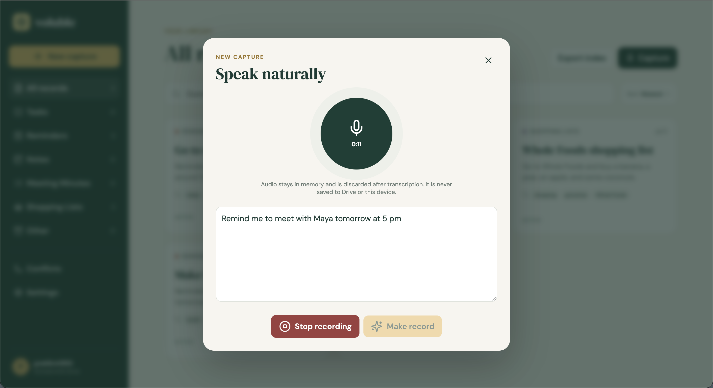

# Voluble

Voluble turns speech into useful tasks, reminders, notes, meeting minutes, and lists. Records stay portable: Google Drive is the source of truth, and every record is stored as human-readable Markdown rather than in a proprietary database.

Voluble is a responsive React PWA with Vercel serverless APIs, Google OAuth and Drive, PostgreSQL for minimal account metadata, and Google Cloud KMS for credential encryption.

## Demo

[Watch the Voluble demo on Google Drive](https://drive.google.com/file/d/1yM1_VAQMQtuS7MqfJzauPhgtlKk0XWUY/view?usp=sharing)

## Previews

| Landing page | Record library | Voice recorder |
| --- | --- | --- |
| [](screenshots/Landing%20Page.png) | [](screenshots/All%20records.png) | [](screenshots/Recorder.png) |

Select a preview to view it at full size.

## What Voluble Does

- Captures up to two hours of speech without intentionally persisting audio.
- Uses on-device speech recognition when the browser and language pack support it.
- Falls back to OpenAI or Gemini cloud transcription when configured.
- Independently selects a provider for transcription and for cleanup/categorization.
- Stores cleaned content alongside the original transcript for auditability.
- Searches, sorts, filters, edits, recategorizes, completes, archives, and trashes records.
- Synchronizes multiple devices through a user-selected Google Drive folder.
- Preserves conflicting versions and resolves them in the Conflict Center.
- Generates adjacent `.ics` calendar files and Google Calendar links without requesting Calendar access.
- Queues text-only changes offline and retries them when connectivity returns.
- Installs as a PWA where the browser exposes installation support.

## User Guide

### 1. Sign in and choose a Drive folder

Select **Start with Google**, approve the requested `drive.file` permission, and either choose an existing folder with Google Picker or create a new folder in My Drive from Voluble. Voluble creates its category structure inside the selected folder and never silently switches to a different folder.

The resulting structure is:

```text
Voluble/
  .voluble/
    settings.json
    credentials.enc.json
    schema.json
  Tasks/
  Reminders/
  Notes/
  Meeting Minutes/
  Shopping Lists/
  Other/
```

The `.voluble` directory contains application metadata and encrypted provider credentials. The category directories contain Markdown records and, where applicable, `.ics` files.

### 2. Configure speech providers

Open **Settings** and choose providers independently:

- **Transcription:** on-device, OpenAI, or Gemini.
- **Cleanup and categorization:** none, OpenAI, or Gemini.
- **Language:** the language used by local recognition and cloud transcription.

If OpenAI or Gemini is selected, enter the corresponding provider key in Settings. Provider keys are not server environment variables. Voluble envelope-encrypts them and writes only the encrypted envelope to the selected Drive folder.

### 3. Capture a record

Select **New capture** or **Capture**, start recording, and speak normally. During cloud transcription, Voluble converts microphone input to small 16 kHz mono WAV chunks in memory, sends them sequentially, and overwrites mutable audio buffers after use.

If on-device recognition is unavailable, Voluble explains why and directs you to choose a cloud provider. If cleanup fails, the original transcript is preserved as a pending record. After correcting the provider or configuration issue, use **Retry processing** on that record to force another cleanup attempt without recording the audio again.

### 4. Work with the library

Use the sidebar to browse categories. Search includes titles, cleaned text, original transcripts, and tags. Open a record to edit its title, category, status, tags, text, transcript, and calendar fields.

For records with event data:

- **Google Calendar** opens a prefilled, user-initiated calendar page.
- **ICS** downloads a standards-based calendar file for Apple Calendar and other clients.

Use **Export index** to download the disposable local index. The Markdown and ICS files in Drive already form the canonical, portable export.

### 5. Resolve synchronization conflicts

If Drive changed since the local copy was edited, Voluble does not overwrite either version. Open **Conflict Center** and choose one of these outcomes:

- Keep the Drive version.
- Keep the local version.
- Merge the versions.
- Keep both as separate records.

### 6. Understand account actions

- **Sign out** removes the current session and local browser data but keeps the encrypted Google refresh token for a future login.
- **Disconnect Drive** revokes Google access, removes stored authentication metadata, and clears local data. Drive files remain untouched.
- **Delete Voluble account** removes backend account state, sessions, encrypted tokens, folder pointers, cookies, and local caches. The selected Drive folder remains owned by the user and must be deleted manually if it is no longer wanted.

## Privacy and Security Model

- Google Drive is authoritative for user content. PostgreSQL stores only minimal account/session metadata, the encrypted refresh token envelope, Drive connection state, and the selected folder pointer.
- Google refresh tokens and provider credentials use AES-256-GCM envelope encryption. Google Cloud KMS wraps each data-encryption key.
- Provider credentials are fetched, unwrapped, and decrypted for one provider invocation only. Mutable plaintext buffers are overwritten in `finally` blocks and are not stored in module globals or cross-request caches.
- Application code does not log request bodies, authorization headers, audio, transcripts, provider keys, or KMS plaintext.
- Audio is not written to Drive, IndexedDB, Cache Storage, backend disk, or provider file-upload storage.
- OpenAI cleanup uses the pinned `gpt-5.4-mini-2026-03-17` snapshot with Responses API storage disabled. OpenAI transcription uses `gpt-4o-mini-transcribe`.
- JavaScript garbage collection cannot guarantee physical memory erasure. The practical boundary is short-lived process/request isolation, no plaintext reuse between requests, reference release, and overwriting mutable buffers where possible.

## Browser Support

The intended support matrix is the latest two releases of Chrome, Edge, Firefox, Safari, Android Chrome, and iOS Safari.

Chrome and Edge may support local speech recognition after a language-pack capability check. Firefox and Safari remain usable through cloud transcription. Microphone capture and speech recognition are capability-gated independently, and unsupported features should produce an actionable explanation.

Firefox desktop works as a responsive web application even on versions without browser-managed PWA installation.

## Developer Guide

### Technology

- Vite, React, and TypeScript
- Vercel Functions
- Google OAuth, Drive API, and Picker API
- Google Cloud KMS
- PostgreSQL through `@vercel/postgres`
- Zod, YAML, and IndexedDB
- Vitest and Playwright
- `vite-plugin-pwa` and Workbox

### Repository map

```text
api/                 Vercel authentication, Drive, and provider endpoints
server/              OAuth, sessions, database, Drive, KMS, and provider helpers
src/api/             Browser API client and serialized mutation queue
src/auth/            Drive/token state transitions
src/components/      Library, recorder, settings, editor, and conflicts UI
src/domain/          Record schemas, Markdown, conflicts, and ICS generation
src/drive/           Google Picker integration
src/recording/       AudioWorklet capture, resampling, and WAV encoding
src/search/          Disposable local full-text filtering and sorting
src/sync/            Retry policy and text-only IndexedDB outbox
tests/               Vitest unit tests
e2e/                 Playwright browser tests
```

### Prerequisites

- Node.js 24 and npm. The repository includes `.nvmrc` and `package.json#engines` pins so local Vercel workers match the deployed runtime.
- Vercel CLI for exercising frontend and serverless APIs together.
- A PostgreSQL database.
- A Google Cloud project with billing configured where KMS requires it.
- A Google OAuth web client, Picker browser key, and KMS key.

### Install

```bash
nvm install
nvm use
npm install
cp .env.example .env.local
```

Fill in `.env.local` using the environment-variable reference below. Never commit `.env.local` or service-account key files.

### Google Cloud setup

1. Enable the **Google Drive API**, **Google Picker API**, and **Cloud Key Management Service API**.
2. Configure an OAuth consent screen.
3. Create an OAuth 2.0 **Web application** client.
4. Add the local callback URI `http://localhost:3000/api/auth/callback` and the production callback `${APP_URL}/api/auth/callback` to the OAuth client.
5. Create a browser API key for Picker. Restrict it to the local and production web origins and to the Picker API.
6. Create a KMS key and copy its full resource name into `GOOGLE_KMS_KEY_NAME`.
7. Give the local/deployed runtime identity permission to encrypt and decrypt with that key. For local development, either run `gcloud auth application-default login` or set `GOOGLE_APPLICATION_CREDENTIALS` to a service-account JSON file.

Voluble requests only OpenID identity, email, and `https://www.googleapis.com/auth/drive.file`. It does not request Google Calendar access.

### PostgreSQL setup

Set `POSTGRES_URL` to a PostgreSQL connection string. The application currently ensures these tables during the first successful OAuth callback:

- `voluble_accounts`
- `voluble_sessions`

For production, create and version an equivalent managed migration before directing user traffic rather than relying solely on runtime schema creation.

### Environment variables

| Variable | Required | Purpose |
| --- | --- | --- |
| `APP_URL` | Yes | Public origin with no trailing slash. Use `http://localhost:3000` with `vercel dev`. |
| `GOOGLE_CLIENT_ID` | Yes | OAuth web-client ID. |
| `GOOGLE_CLIENT_SECRET` | Yes | OAuth web-client secret; server-side only. |
| `GOOGLE_CLOUD_PROJECT` | Yes | Numeric Google Cloud project number supplied to Picker as its app ID. Despite the variable name, do not use the project ID. |
| `GOOGLE_PICKER_API_KEY` | Yes | Origin- and API-restricted browser key for Google Picker. It is intentionally returned to the browser. |
| `GOOGLE_KMS_KEY_NAME` | Yes | Full KMS CryptoKey resource name. |
| `GCP_PROJECT_NUMBER` | On Vercel | Numeric project number used by Workload Identity Federation. |
| `GCP_SERVICE_ACCOUNT_EMAIL` | On Vercel | Service account impersonated by the Vercel workload identity. |
| `GCP_SERVICE_ACCOUNT_ID` | Recommended on Vercel | Immutable numeric service-account ID used instead of email lookup. |
| `GCP_WORKLOAD_IDENTITY_POOL_ID` | On Vercel | Workload Identity Pool ID, commonly `vercel`. |
| `GCP_WORKLOAD_IDENTITY_POOL_PROVIDER_ID` | On Vercel | OIDC provider ID, commonly `vercel`. |
| `POSTGRES_URL` | Yes | PostgreSQL connection string used by `@vercel/postgres`. |
| `SESSION_SECRET` | Yes | High-entropy secret used to authenticate short-lived OAuth state tokens. |
| `GOOGLE_APPLICATION_CREDENTIALS` | Conditional | Local path to a Google service-account JSON file. Omit when Application Default Credentials are already available. |
| `OPENAI_CLEANUP_MODEL` | No | Overrides the pinned OpenAI cleanup snapshot. Leave unset for reproducible default behavior. |

Generate a session secret with:

```bash
openssl rand -base64 48
```

OpenAI and Gemini user API keys are deliberately absent from `.env.example`; enter them through the application Settings page.

### Run locally

Run the complete application, including Vercel Functions:

```bash
npm run dev:full
```

This command validates Node 24, loads and checks `.env.local` without printing its secrets, and then starts Vercel on port 3000. Restart it after changing environment variables. The first run may ask you to link or create a Vercel project. Confirm that `APP_URL` and the OAuth callback use the same origin and port.

For frontend-only work:

```bash
npm run dev
```

The frontend-only Vite server defaults to `http://localhost:5173`, but authentication, Drive, and provider endpoints will not work without a serverless API runtime.

### Test and build

```bash
npm run check          # TypeScript and Vitest
npm run build          # Production PWA build
npm run test:e2e       # Full configured Playwright matrix
```

Install Playwright browser binaries once when needed:

```bash
npx playwright install
```

Live OAuth, Picker, Drive, KMS, provider, revocation, and account-deletion verification requires a configured test cloud environment. Unit tests do not require real provider or Google credentials.

### Deploy to Vercel

1. Import the repository into Vercel and attach a PostgreSQL integration that exposes `POSTGRES_URL`.
2. Add every required variable from `.env.example` for Preview and Production as appropriate.
3. Provide Google Application Default Credentials to the Vercel runtime, preferably through workload identity federation or another short-lived identity mechanism. Avoid committing service-account JSON.
4. Set `APP_URL` to the final HTTPS origin.
5. Add `${APP_URL}/api/auth/callback` to the Google OAuth client and add the origin to the Picker key restrictions.
6. Deploy and test login, folder selection, KMS encryption, provider configuration, one record write, an ICS update, sign-out, and token revocation.

`vercel.json` defines the PWA deployment, serverless duration, security headers, Content Security Policy, and microphone permission policy.

## Synchronization and Failure Behavior

- Initial bootstrap reads the selected category folders; later refreshes use Drive change cursors.
- Record content reads run at a maximum concurrency of three. Browser mutations use one serialized queue.
- UUID app properties make uncertain create retries idempotent.
- Retryable quota and server responses use `Retry-After` or full-jitter exponential backoff capped at 32 seconds and six attempts.
- Exhausted operations enter an IndexedDB outbox containing text records only.
- Authentication failures, quota exhaustion, conflicts, and ordinary network failures are reported separately.
- After revoked consent or repeated authorization failures, Drive writes stop, pending local text is retained, and cached Drive records become read-only until re-consent.
- Folder reselection is requested only when the selected folder is no longer accessible.

## Troubleshooting

### `ECONNRESET`, `ERR_IPC_CHANNEL_CLOSED`, or `localStorage` warnings from `vercel dev`

Check `node --version`. Voluble pins Node 24 because Vercel Functions support Node 20, 22, and 24—not Node 26. Run `nvm install`, `nvm use`, and verify that `node --version` reports `v24.x` before restarting `vercel dev`. If another Node installation still takes precedence, place the NVM-selected binary first with `export PATH="$(dirname "$(nvm which 24)"):$PATH"` and run `hash -r`.

### OAuth callback mismatch

Ensure `APP_URL` exactly matches the browser origin and `${APP_URL}/api/auth/callback` appears in the OAuth client’s authorized redirect URIs. A port difference counts as a different origin.

### Picker opens but cannot select the intended folder

Confirm that the Picker API is enabled, `GOOGLE_CLOUD_PROJECT` is the numeric project number rather than the project ID or display name, and the Picker key allows the current origin.

### KMS permission or credential errors

Verify Application Default Credentials first, then confirm that the active identity has encrypt/decrypt permission for the exact key in `GOOGLE_KMS_KEY_NAME`.

### Local recognition is unavailable

Local recognition depends on browser support and an installed language pack. Select OpenAI or Gemini transcription in Settings to use the cloud fallback.

### Records remain pending

Check connectivity and Drive connection state. Bring the app to the foreground or reconnect to trigger outbox replay. Re-consent if Voluble reports that Google authorization was revoked.

## OpenAI API References

The OpenAI provider implementation follows the official [GPT-5.4 mini model documentation](https://developers.openai.com/api/docs/models/gpt-5.4-mini), [structured outputs guide](https://developers.openai.com/api/docs/guides/structured-outputs), and [GPT-4o mini Transcribe documentation](https://developers.openai.com/api/docs/models/gpt-4o-mini-transcribe).
